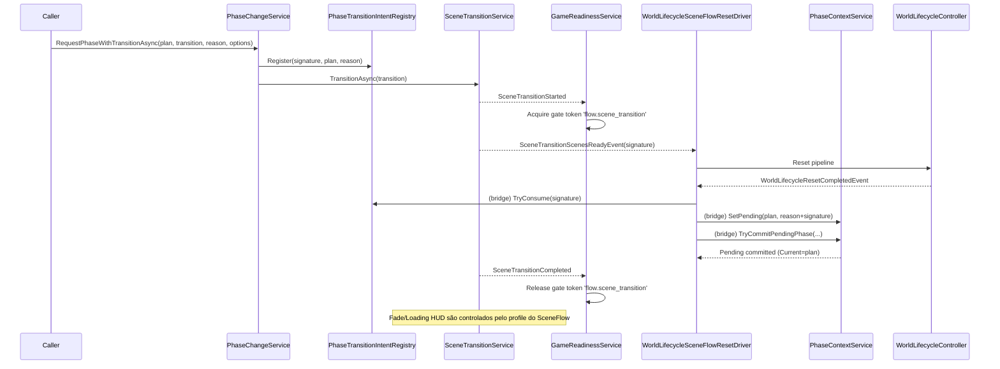

# ADR-0017 — Tipos de troca de fase (In-Place vs SceneTransition)

## Status
- Estado: Implementado
- Data: 2025-12-24
- Implementado em: 2026-01-18
- Escopo: PhaseChange + SceneFlow (NewScripts)

## Contexto

O sistema de fases precisa suportar dois tipos de troca com objetivos distintos:

- **Troca dentro do gameplay** (ex.: “fase 1 concluída, inicia fase 2 na mesma rodada”), sem descarregar a cena base.
- **Troca com transição completa** (ex.: nova fase exige troca de cenas, unload de conteúdos atuais, loading e fade).

A meta é eliminar ambiguidades (ex.: “troca de fase” significar tanto reset in-place quanto scene transition), mantendo rastreabilidade por `contextSignature/reason` e evitando regressões do baseline.

### Baseline 2.0 (Opção B) / Escopo

- **IntroStage não é exigido pelo baseline** atual, pois não há evidência no smoke log vigente.
- A validação de IntroStage será feita em smoke separado (Baseline 2.1 ou “IntroStage smoke”) quando o fluxo estiver promovido.

## Decisão

Existem **dois tipos explícitos** de troca de fase, com APIs e contratos distintos (nomes reais do código):

### 1) PhaseChange/In-Place

**Quando usar:** a fase muda dentro da mesma “rodada”/cena (sem unload/load de cena).

**API (overloads canônicos):**

- `PhaseChangeService.RequestPhaseInPlaceAsync(PhasePlan plan, string reason)`
- `PhaseChangeService.RequestPhaseInPlaceAsync(string phaseId, string reason, PhaseChangeOptions? options = null)`
- `PhaseChangeService.RequestPhaseInPlaceAsync(PhasePlan plan, string reason, PhaseChangeOptions? options)`

**Contrato operacional:**

- Executa reset determinístico **sem SceneFlow**.
- **Sem Loading HUD** (mesmo se solicitado via options, o serviço ignora por design).
- **Fade opcional** (via `options.UseFade=true`) permitido como “mini transição” quando for desejável esconder reconstrução do reset.
- Gate/serialização: token `flow.phase_inplace`.
- Timeout: `options.TimeoutMs`.

### 2) PhaseChange/SceneTransition

**Quando usar:** a nova fase exige transição completa (cenas, recursos pesados, feedback visual de loading, etc.).

**API (overloads canônicos):**

- `PhaseChangeService.RequestPhaseWithTransitionAsync(PhasePlan plan, SceneTransitionRequest transition, string reason)`
- `PhaseChangeService.RequestPhaseWithTransitionAsync(string phaseId, SceneTransitionRequest transition, string reason, PhaseChangeOptions? options = null)`
- `PhaseChangeService.RequestPhaseWithTransitionAsync(PhasePlan plan, SceneTransitionRequest transition, string reason, PhaseChangeOptions? options)`

**Contrato operacional:**

- Registra intent (`PhaseTransitionIntentRegistry`) e inicia **SceneFlow** via `ISceneTransitionService.TransitionAsync(transition)`.
- O `WorldLifecycleSceneFlowResetDriver` dispara o reset em `SceneTransitionScenesReadyEvent` (profile gameplay). O consumo do intent e o commit da fase ocorrem após `WorldLifecycleResetCompletedEvent` via `PhaseTransitionIntentWorldLifecycleBridge`.
- Gate de simulação durante a transição é governado pelo token padrão do SceneFlow (`flow.scene_transition`).
- Fade/HUD são controlados pelo **profile do `SceneTransitionRequest`** (não por `PhaseChangeOptions`).
- Timeout: `options.TimeoutMs`.

## Fora de escopo

- (não informado)

## Consequências

### Benefícios

- Nomenclatura elimina ambiguidade de “troca de fase”.
- In-Place atende casos de “próxima fase no mesmo gameplay” sem custo de trocar cenas.
- SceneTransition atende casos de “nova fase exige troca de conteúdo pesado” com feedback visual e reset canônico.

### Trade-offs / Riscos

- In-Place não deve depender de loading HUD; quando precisar de experiência completa de loading, usar SceneTransition.
- Permitir `UseFade` no In-Place adiciona flexibilidade, mas exige disciplina de uso (para não virar “transição completa disfarçada”).

## Notas de implementação

### Termos e tipos (nomes reais do código)

- `PhasePlan`
  - `PhaseId` (identificador lógico da fase)
  - `ContentSignature` (assinatura rastreável do “conteúdo montado”)
- `PhaseContextService`
  - `Current` / `Pending`
  - `TryCommitPendingPhase(...)`
- `PhaseTransitionIntentRegistry`
  - `Register(...)` / `TryConsume(...)`
- `PhaseChangeOptions`
  - `UseFade`, `UseLoadingHud`, `TimeoutMs`
- `SceneTransitionRequest`
  - representa a solicitação do SceneFlow (load/unload/active/profile/useFade/contextSignature)

### Diagramas (sequência)

#### In-Place

```mermaid
sequenceDiagram
    participant Caller as Caller
    participant PhaseChange as PhaseChangeService
    participant WL as WorldLifecycleSceneFlowResetDriver
    participant WLC as WorldLifecycleController
    participant PhaseCtx as PhaseContextService

    Caller->>PhaseChange: RequestPhaseInPlaceAsync(plan, reason, options)
    PhaseChange->>PhaseCtx: SetPending(plan, reason+signature)
    PhaseChange->>WL: ResetAsync(sourceSignature="phase.inplace:<PhaseId>")
    WL->>WLC: Reset pipeline (despawn/spawn/hooks)
    WLC-->>WL: ResetCompleted
    WL->>PhaseCtx: TryCommitPendingPhase(...)
    PhaseCtx-->>PhaseChange: Pending committed (Current=plan)

    Note over PhaseChange: Contrato: sem Loading HUD; Fade opcional (UseFade)
    Note over PhaseChange: Sem SceneFlow (não há unload/load de cenas)
```

#### SceneTransition



## Evidências

- Metodologia: [`Reports/Evidence/README.md`](../Reports/Evidence/README.md)
- Evidência canônica (LATEST): [`Reports/Evidence/LATEST.md`](../Reports/Evidence/LATEST.md)
- Snapshot (2026-01-18): [`Baseline-2.1-Evidence-2026-01-18.md`](../Reports/Evidence/2026-01-18/Baseline-2.1-Evidence-2026-01-18.md)
- ADR-0017 Evidence (2026-01-18): [`ADR-0017-Evidence-2026-01-18.md`](../Reports/Evidence/2026-01-18/ADR-0017-Evidence-2026-01-18.md)
- Contrato: [`Observability-Contract.md`](../Reports/Observability-Contract.md)

## Referências

- [ADR-0016 — Phases + modos de avanço + IntroStage opcional](ADR-0016-Phases-WorldLifecycle.md)
- [WORLD_LIFECYCLE.md](../WORLD_LIFECYCLE.md)
- [Observability-Contract.md](../Reports/Observability-Contract.md) — contrato canônico de reasons, campos mínimos e invariantes
