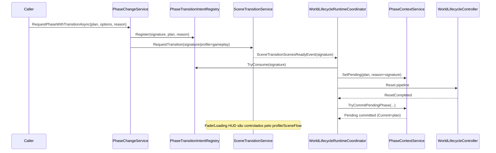

# ADR-0017 — Tipos de troca de fase (In-Place vs SceneTransition)

## Status

**Aceito / Ativo**

## Contexto

O sistema de fases precisa suportar dois tipos de troca com objetivos distintos:

- **Troca dentro do gameplay** (ex.: “fase 1 concluída, inicia fase 2 na mesma rodada”), sem descarregar a cena base.
- **Troca com transição completa** (ex.: nova fase exige troca de cenas, unload de conteúdos atuais, loading e fade).

A meta é eliminar ambiguidades (ex.: “troca de fase” significar tanto reset in-place quanto scene transition), mantendo rastreabilidade por `contextSignature/reason` e evitando regressões do baseline.

## Decisão

Existem **dois tipos explícitos** de troca de fase, com APIs e contratos distintos:

1. **PhaseChange/In-Place**
    - API: `PhaseChangeService.RequestPhaseInPlaceAsync(PhasePlan plan, PhaseChangeOptions options, string reason)`
    - Executa reset determinístico **sem SceneFlow**.
    - **Sem Loading HUD** (mesmo se solicitado via options, o serviço ignora no In-Place).
    - **Fade opcional** (`options.UseFade=true`) permitido como “mini transição” quando for desejável esconder reconstrução do reset.
    - Token de gate: `flow.phase_inplace`.

2. **PhaseChange/SceneTransition**
    - API: `PhaseChangeService.RequestPhaseWithTransitionAsync(PhasePlan plan, PhaseChangeOptions options, string reason)`
    - Registra intent e inicia **SceneFlow** (transição completa, com Fade/Loading conforme profile).
    - O `WorldLifecycleRuntimeCoordinator` consome o intent em `SceneTransitionScenesReadyEvent`, seta `Pending`, executa reset e faz commit da fase após o reset.
    - Token de gate: `flow.phase_transition`.

### Termos e tipos (nomes reais do código)

- `PhasePlan`:
    - `PhaseId` (identificador lógico da fase)
    - `ContentSignature` (assinatura rastreável do “conteúdo montado”)
- `PhaseContextService`:
    - `Current` / `Pending`
    - `TryCommitPendingPhase(...)`
- `PhaseTransitionIntentRegistry`:
    - `Register(...)` / `TryConsume(...)`
- `PhaseChangeOptions`:
    - `UseFade`, `UseLoadingHud`, `TimeoutMs`

## Diagrama 1 — Sequência (In-Place)

```mermaid
sequenceDiagram
    participant Caller as Caller
    participant PhaseChange as PhaseChangeService
    participant WL as WorldLifecycleRuntimeCoordinator
    participant WLC as WorldLifecycleController
    participant PhaseCtx as PhaseContextService

    Caller->>PhaseChange: RequestPhaseInPlaceAsync(plan, options, reason)
    PhaseChange->>PhaseCtx: SetPending(plan, reason+signature)
    PhaseChange->>WL: ResetAsync(sourceSignature="phase.inplace:<PhaseId>")
    WL->>WLC: Reset pipeline (despawn/spawn/hooks)
    WLC-->>WL: ResetCompleted
    WL->>PhaseCtx: TryCommitPendingPhase(...)
    PhaseCtx-->>PhaseChange: Pending committed (Current=plan)

    Note over PhaseChange: Contrato: sem Loading HUD; Fade opcional (UseFade)
    Note over PhaseChange: Sem SceneFlow (não há unload/load de cenas)
```

## Diagrama 2 — Sequência (SceneTransition)



## Consequências

### Benefícios

- Nomenclatura elimina ambiguidade de “troca de fase”.
- In-Place atende casos de “próxima fase no mesmo gameplay” sem custo de trocar cenas.
- SceneTransition atende casos de “nova fase exige troca de conteúdo pesado” (cenas/recursos) com feedback visual e reset canônico.

### Trade-offs

- In-Place não deve depender de loading HUD; quando precisar de experiência completa de loading, usar SceneTransition.
- Permitir `UseFade` no In-Place adiciona flexibilidade, mas exige disciplina de uso (para não virar “transição completa disfarçada”).

## Como testar (QA)

- `QA/Phase/Advance In-Place (TestCase: PhaseInPlace)`
- `QA/Phase/Advance With Transition (TestCase: PhaseWithTransition)`

## Referências

- ADR-0016 — Phases + modos de avanço + Pregame opcional
- WorldLifecycle/SceneFlow — ordem de eventos e reset determinístico
