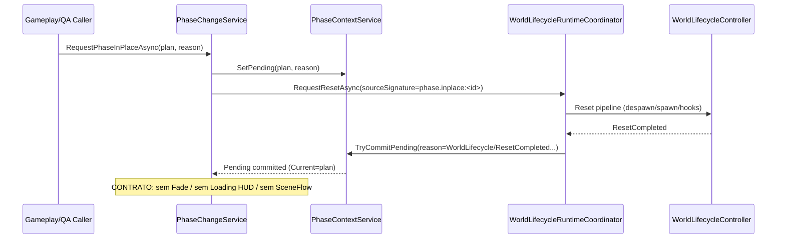
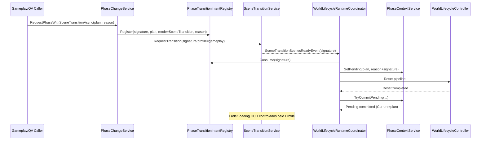

# ADR-0017 — Tipos de troca de fase (In-Place vs SceneTransition)

## Status

**Aceito / Ativo**

## Contexto

O sistema de fases precisa suportar dois tipos de troca com objetivos distintos:

- **Troca dentro do gameplay** (ex.: “fase 1 concluída, inicia fase 2 na mesma rodada”), sem descarregar a cena base.
- **Troca com transição completa** (ex.: nova fase exige troca de cenas, unload de conteúdos atuais, loading e fade).

Durante QA, observou-se que o modo In-Place pode ser executado com Fade/Loading HUD via opções de teste. Contudo, a intenção de design é que a troca **In-Place flua sem interrupções visuais**, ao contrário de SceneTransition, que por regra geral envolve transição/visual feedback.

## Decisão

### 1) Definir dois tipos explícitos

1. **PhaseChange/In-Place**
    - **Não** executa `ISceneTransitionService` (SceneFlow).
    - **Não** descarrega a cena base do gameplay.
    - Pode **adicionar** cenas (Additive) se necessário, mas a cena base permanece carregada.
    - Realiza **World Reset** para aplicar spawns/dados da nova fase.
    - **Contrato visual:** **não deve** disparar Fade e **não deve** exibir Loading HUD.
      Se algum “curtain” for necessário no futuro, será um **terceiro modo explícito** (não “In-Place”).

2. **PhaseChange/SceneTransition**
    - Executa `ISceneTransitionService` (SceneFlow).
    - Pode descarregar/recarregar a cena base e outras cenas (reload/unload).
    - Usa Fade/Loading conforme perfil de transição (SceneFlow Profile).
    - Aplica a fase via intent consumido em `ScenesReady` e commit no `ResetCompleted`.

### 2) Regras operacionais

- Ambos os tipos:
    - bloqueiam ação via SimulationGate (token dedicado) enquanto a troca está em curso,
    - setam `Pending` antes do reset (direto ou em ScenesReady),
    - fazem commit de `Pending` em `WorldLifecycleResetCompleted`.

- Apenas SceneTransition:
    - mantém um `signature` de SceneFlow para correlacionar intent ↔ ScenesReady ↔ reset.

### 3) Política de UX/Visual (contrato)

- **In-Place**: sem interrupção visual, sem Fade, sem Loading HUD.
- **SceneTransition**: Fade + Loading HUD permitido/esperado e controlado por perfil de transição (e.g. `gameplay`).

Isso evita ambiguidade: “In-Place” significa continuidade visual do gameplay; “SceneTransition” significa transição visível.

## Diagramas

### Diagrama 1 — Sequência (In-Place)

### Diagrama 2 — Sequência (SceneTransition)

## Consequências

### Benefícios

- A nomenclatura elimina ambiguidade de produto/QA:
    - In-Place = continuidade visual + reset determinístico.
    - SceneTransition = transição visível + possível unload/reload.

- A arquitetura permanece coerente com Baseline 2.0:
    - Reset e commit continuam canônicos e observáveis.

### Trade-offs

- In-Place exige que qualquer reorganização de conteúdo que “precise de cortina” seja modelada como outro modo explícito no futuro.
- SceneTransition tem maior custo (load/unload) e maior risco de regressões, porém é necessário quando a fase requer troca de cenas.

## Ações derivadas (obrigatórias para compliance do ADR)

1. **Ignorar/forçar desligado** Fade/HUD em In-Place no código de produção.
    - Se alguma API aceitar `options`, deve sanitizar para `UseFade=false` e `UseLoadingHud=false` (ou emitir warning e ignorar).
2. Atualizar QA:
    - O teste In-Place não deve habilitar Fade/HUD.
    - Opcionalmente, criar um teste separado “InPlaceWithCurtain (experimental)” se for necessário testar efeitos visuais.
