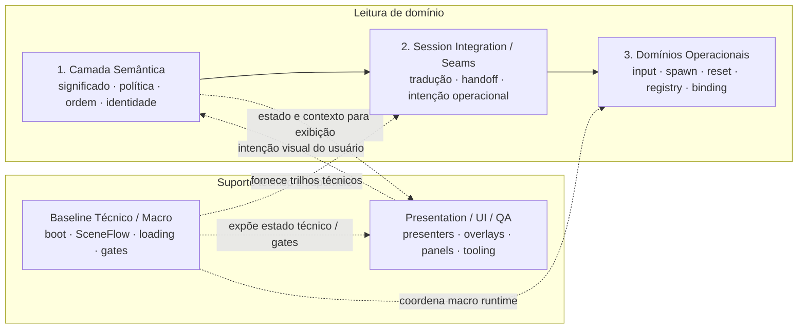
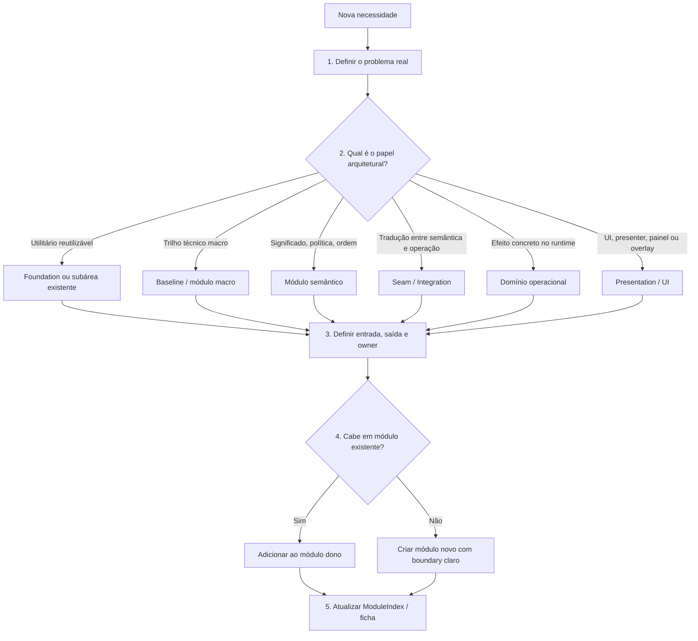

# Base Overview

> Fonte de leitura: snapshot do projeto em 2026-04-29.

Este documento é a porta de entrada para ler a arquitetura runtime de `NewScripts`.
Ele não substitui ADRs, não valida implementação e não tenta listar todos os arquivos do projeto.

Use este documento para entender:

- como a base deve ser lida;
- quais são os grandes papéis arquiteturais;
- onde cada tipo de responsabilidade deve morar;
- como evitar regressões de ownership;
- como decidir onde um novo módulo ou feature deve entrar.

Para inventário de módulos reais, use `ModuleIndex.md`.
Para utilitários reutilizáveis, use `Foundation/README.md` e seus guias específicos.

---

## 1. Como ler os diagramas deste documento

Os diagramas deste overview são **mapas de leitura arquitetural**, não timelines de execução.

A posição dos grupos é intencional:

- leia de cima para baixo dentro de cada coluna;
- leia da esquerda para a direita entre colunas;
- setas cheias indicam relação primária de responsabilidade;
- setas pontilhadas indicam suporte, consumo ou reação;
- ordem visual não significa ordem exata de eventos runtime.

Quando precisar entender sequência real de eventos, use documentos em `Flows/`.

---

## 2. Regra central

**Ownership não é decidido por quem executa o código.**

Ownership é decidido pelo papel arquitetural do módulo.

Um módulo pode executar algo no runtime sem ser dono da semântica daquele comportamento. Essa regra evita regressões como:

- `Spawn` parecer owner de actors;
- `InputModes` parecer owner de sessão;
- `SceneFlow` parecer owner de gameplay;
- `Navigation` virar atalho de restart;
- bootstraps acumularem costura semântica;
- bridges oportunistas substituírem seams explícitos.

---

## 3. Nota sobre Foundation

`Foundation` não aparece nos diagramas principais porque não é uma etapa do fluxo runtime nem um owner de domínio.

Ela é uma biblioteca interna de ferramentas reutilizáveis: eventos, FSM, logging, validação, composição, pooling, config e utilidades de runtime.

Quando um módulo usa `Foundation`, isso não cria dependência arquitetural de domínio. Apenas indica uso de infraestrutura comum.

---

## 4. Papéis arquiteturais da Base

| Papel | Função | Não deve fazer |
|---|---|---|
| Camada Semântica | Define significado, política, ordem, identidade e composição | Executar efeito concreto por conveniência |
| Session Integration / Seams | Traduz verdade semântica em intenção operacional | Virar owner semântico ou executor final |
| Domínios Operacionais | Executam efeitos concretos no runtime | Reivindicar ownership semântico por executar |
| Baseline Técnico / Macro | Fornece boot, transições macro, loading, gates e rails técnicos | Definir gameplay, sessão, participation ou actors |
| Presentation / UI / QA | Mostra estado, recebe intenção visual e auxilia validação manual | Decidir semântica ou executar rails canônicos por atalho |

---

## 5. Mapa de leitura da Base

Este é o mapa principal de leitura. A coluna da esquerda representa a cadeia de responsabilidade de domínio. A coluna da direita representa suporte técnico e superfície visual.

Leitura correta:

1. A semântica define o significado do que deve acontecer.
2. O seam traduz essa verdade em intenção operacional.
3. Os domínios operacionais executam o efeito concreto.
4. O baseline fornece trilhos técnicos, mas não decide semântica.
5. Presentation/UI mostra estado e coleta intenção visual, mas não vira owner do fluxo.

---

## 6. Mapa de módulos por papel

Este mapa também é uma projeção de responsabilidade. Ele ajuda a localizar módulos por papel, não a reconstruir ordem de execução.

```mermaid
flowchart LR
    subgraph Left["Domínio: significado → tradução → execução"]
        direction TB

        subgraph SemanticGroup["1. Camada Semântica"]
            direction TB
            GameplaySessionFlow["GameplaySessionFlow"]
            SessionTransition["SessionTransition"]
            PhaseCatalog["PhaseCatalog"]
            PhaseDefinition["PhaseDefinition"]
            Participation["Participation"]
            ActorsSystem["ActorsSystem"]
        end

        subgraph SeamGroup["2. Seams / Integration"]
            direction TB
            SessionIntegration["SessionIntegration"]
            ActorsExecution["ActorsExecution Handoff"]
            InputRequests["InputMode Requests"]
        end

        subgraph OperationalGroup["3. Domínios Operacionais"]
            direction TB
            InputModes["InputModes"]
            Spawn["Spawn / Materialization"]
            ResetFlow["ResetFlow"]
            ActorRegistry["ActorRegistry / Runtime Presence"]
            OperationalBinding["Actors Operational Binding"]
        end

        SemanticGroup --> SeamGroup
        SeamGroup --> OperationalGroup
    end

    subgraph Right["Suporte macro e superfície"]
        direction TB

        subgraph BaselineGroup["Baseline Técnico / Macro"]
            direction TB
            SceneFlow["SceneFlow"]
            Navigation["Navigation"]
            Loading["Loading / Fade"]
            GameLoop["GameLoop"]
            Gates["Readiness / Gates"]
        end

        subgraph PresentationGroup["Presentation / UI / QA"]
            direction TB
            IntroStage["IntroStage Presenters"]
            RunResult["RunResult / RunDecision UI"]
            QaPanels["QA Panels"]
        end

        BaselineGroup -. "suporte técnico" .-> PresentationGroup
    end

    BaselineGroup -. "trilhos macro" .-> SeamGroup
    BaselineGroup -. "gates / lifecycle técnico" .-> OperationalGroup
    SemanticGroup -. "contexto para exibição" .-> PresentationGroup
```

Regra de leitura:

- coluna esquerda: responsabilidade de domínio;
- coluna direita: suporte macro e apresentação;
- grupos mais altos são mais próximos de decisão/meaning;
- grupos mais baixos são mais próximos de execução/superfície;
- isso não substitui os fluxos específicos.

---

## 7. Como ler um módulo

Ao abrir um módulo, classifique primeiro o papel dele:

| Pergunta | Papel provável |
|---|---|
| Define significado, política, ordem, identidade ou composição? | Semântico |
| Traduz estado semântico em intenção operacional? | Seam / Integration |
| Executa boot, cena macro, loading, gates ou rail técnico? | Baseline |
| Aplica efeito concreto no runtime? | Operacional |
| Mostra UI, presenter, overlay ou painel QA? | Presentation / UI |
| É ferramenta reutilizável sem domínio próprio? | Foundation |

Depois pergunte:

1. Qual é a entrada do módulo?
2. Qual é a saída?
3. Quem consome essa saída?
4. O módulo está decidindo algo que pertence a outro owner?
5. Existe atalho, bridge oportunista ou fallback silencioso?

---

## 8. Como inserir um novo módulo ou feature

Este diagrama é uma ordem de decisão. Aqui a ordem visual é mais próxima de um processo real de design.

Regra prática:

1. Defina o problema antes da solução.
2. Classifique o papel arquitetural.
3. Prefira o módulo dono do problema.
4. Evite criar bridge se o problema pede seam real.
5. Evite colocar lógica de domínio em bootstrap.
6. Evite fallback silencioso para configuração obrigatória.

---

## 9. Anti-patterns

Evite os seguintes padrões:

- bootstrap acumulando lógica de domínio;
- bridge oportunista substituindo seam;
- executor operacional decidindo semântica;
- `Navigation` usado como atalho de restart;
- `Spawn` usado como source of truth de actors;
- `PlayerInput` usado como identidade semântica;
- evento usado para esconder dependência obrigatória;
- fallback silencioso para config obrigatória;
- UI ou painel QA executando rail paralelo;
- código novo reforçando nomenclatura histórica superada.

---

## 10. Relação com outros documentos

| Documento | Função |
|---|---|
| `ModuleIndex.md` | Inventário e classificação dos módulos reais |
| `Foundation/README.md` | Guia dos utilitários reutilizáveis |
| `Flows/*.md` | Fluxos canônicos atravessando módulos, com ordem de execução |
| `Modules/*.md` | Fichas individuais dos módulos |
| ADRs | Referência normativa de decisões e boundaries |

## 11. Próxima leitura recomendada

Após este overview, leia nesta ordem:

1. `ModuleIndex.md`
2. `Foundation/README.md`, se precisar de utilitários comuns
3. `Flows/*.md`, quando o problema for ordem real de eventos
4. `Modules/*.md`, quando o problema for ownership de um módulo específico
