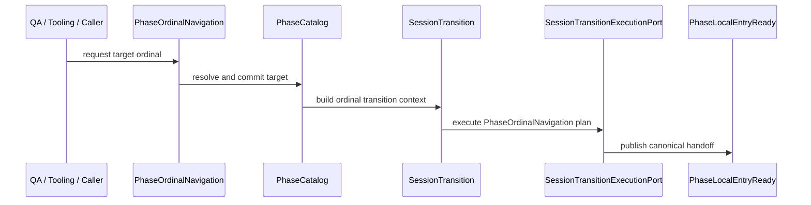

# Flow: PhaseOrdinalNavigation

> Status: draft. This flow exists because QA/tooling and explicit ordinal navigation must not bypass SessionTransition.

## Goal

Allow Next, Previous, GoTo and GoFirst style ordinal phase navigation without bypassing canonical session/runtime transformation.

## Canonical reading

PhaseOrdinalNavigation resolves/commits the requested ordinal target in `PhaseCatalog`, then delegates operational transformation to `SessionTransition`.

## High-level sequence

## Owners by step

| Step | Owner | Responsibility |
|---|---|---|
| User/tooling request | QA panel or caller | Emits explicit ordinal intent |
| Target resolution | PhaseOrdinalNavigation / PhaseCatalog | Resolve/commit target ordinal |
| Transition plan | SessionTransitionPlanResolver | Produce `PhaseOrdinalNavigation` execution kind |
| Execution | SessionTransitionExecutionPort / Orchestrator | Execute local transition and publish canonical handoff |
| Downstream readiness | Actors / GameplayPhaseFlow / IntroStage | Consume handoff normally |

## Not allowed

- QA buttons must not be removed just to hide errors.
- PhaseOrdinalNavigation must not publish phase-local handoff directly.
- Do not use deprecated `PhaseNextPhaseService`.
- Do not bypass SessionTransition for convenience.
