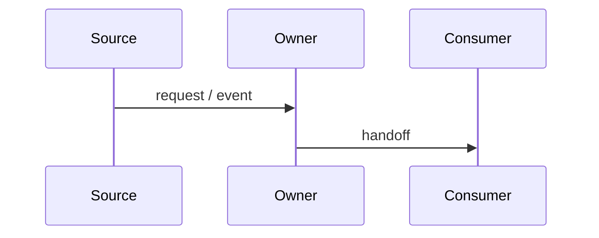

# Flow: <FlowName>

> Status: draft / audited / final

## Goal

<What this flow achieves.>

## Canonical sequence

## Owners by step

| Step | Owner | Responsibility |
|---|---|---|
| ... | ... | ... |

## Events and handoffs

| Order | Event / Handoff | Publisher | Consumer |
|---|---|---|---|
| 1 | ... | ... | ... |

## Expected logs

- ...

## Common failure shapes

- ...

## Not allowed

- ...

## Source audit notes

- ...
