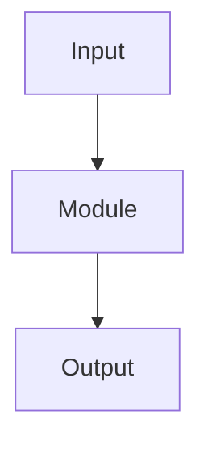

# Module: <ModuleName>

> Status: draft / audited / final  
> Scope: `<path>`

## 1. One-line summary

<One sentence.>

## 2. Architectural role

Semantic / Seam / Baseline technical-macro / Operational executor / Hybrid transitional.

## 3. What it owns

- ...

## 4. What it does not own

- ...

## 5. Why it exists

<Problem solved by the module.>

## 6. How it works

## 7. Main inputs

| Input | Source owner | Notes |
|---|---|---|
| ... | ... | ... |

## 8. Main outputs

| Output | Consumer | Notes |
|---|---|---|
| ... | ... | ... |

## 9. Key files

| File | Purpose |
|---|---|
| ... | ... |

## 10. Extension points

- ...

## 11. Forbidden changes

- ...

## 12. Related ADRs

- ...

## 13. Code audit notes

- ...
