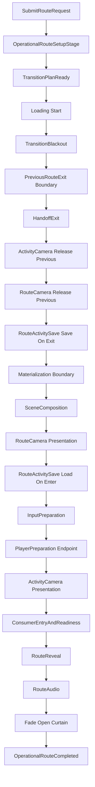

# SessionOperational — Guia de Aplicação

Status: `Base 2.0 / SessionOperational normalized`

Este documento explica **como aplicar, configurar e usar** o módulo `SessionOperational` depois da normalização arquitetural da Base 2.0.

Ele não é um ADR. O ADR define as regras de ownership. Este guia é operacional: serve para quem vai criar rotas, integrar módulos ao fluxo operacional, interpretar logs e validar smoke.

---

## 1. Finalidade do módulo

`SessionOperational` é o pipeline canônico de **troca de rota operacional**.

Ele existe para orquestrar a passagem entre superfícies de runtime, por exemplo:

- boot → menu;
- menu → gameplay/session activity;
- gameplay/session activity → menu;
- rota frontend sem handoff;
- rota com handoff para `SessionActivity`;
- rota com loading, fade, áudio, input, câmera, scene composition e route activity save.

O módulo não é dono do ciclo interno da activity. Ele prepara a rota e entrega o controle para o consumidor correto.

---

## 2. Quando usar

Use `SessionOperational` quando a intenção for **entrar, trocar ou sair de uma rota operacional**.

Exemplos válidos:

```text
Abrir o menu inicial.
Ir do menu para a rota de gameplay.
Voltar de SessionActivity para menu.
Aplicar scenes da rota.
Preparar route camera ou activity camera da rota.
Preparar input mode inicial da rota.
Carregar snapshot de activity na entrada de rota.
Salvar snapshot de activity na saída de rota anterior.
Executar handoff de entrada ou saída com SessionActivity.
```

Não use `SessionOperational` para:

```text
Controlar lifecycle interno de uma activity.
Executar regras locais de objeto.
Aplicar atributos de actor.
Resolver movimento diretamente.
Controlar lógica local de UI/gameplay.
Executar side-effects fora de adapter/endpoint apropriado.
```

---

## 3. Modelo mental

O fluxo é composto por quatro camadas principais:

| Camada | Responsabilidade |
|---|---|
| `OperationalRouteAsset` | Authoring data da rota. Declara cenas, input, handoff, audio, loading, save, surface/activity presentation. |
| `SessionOperationalPipeline` | Owner de ordem, lifecycle, gate macro, begin/reset, route operation e handoff operacional. |
| `Operational*Stage` / `Operational*Boundary` | Executam passos determinísticos e classificam skip/fail local quando a decisão pertence ao passo. Boundary marca bloco macro e não chama sub-stage. |
| `Adapters` / `Endpoints` | Executam side-effects comandados. Não decidem lifecycle/policy. |

Regra de ouro:

```text
Pipeline decide quando e em que ordem.
Stage resolve o passo determinístico.
Adapter/endpoint executa o side-effect técnico.
Fact registra o ocorrido.
```

---

## 4. Ownership atual congelado

| Área | Owner correto |
|---|---|
| Ordem da operação de rota | `SessionOperationalPipeline` |
| Begin/reset da route operation | `SessionOperationalPipeline` |
| Stage-order gate | `SessionOperationalPipeline` + `SessionOperationalStageOrderPolicy` |
| Facts/traces | `OperationalFactRecorder` |
| Previous route exit macro | `OperationalPreviousRouteExitBoundary` + stages explícitos no pipeline |
| Materialization macro | `OperationalRouteMaterializationBoundary` + stages explícitos no pipeline |
| Scene composition | `OperationalSceneCompositionStage` → `SceneCompositionAdapter` |
| Fade | `OperationalFadeStage` → `FadeAdapter` |
| Loading | `OperationalLoadingStage` → `LoadingAdapter` |
| Route audio | `OperationalRouteAudioStage` → `AudioAdapter` |
| Route camera | `OperationalRouteCameraPresentationStage` / `OperationalRouteCameraReleasePreviousStage` → `SessionOperationalRouteCameraAdapter` |
| Activity camera | `OperationalActivityCameraPresentationStage` / `OperationalActivityCameraReleasePreviousStage` → `SessionOperationalActivityCameraAdapter` |
| Route activity save | `OperationalRouteActivitySaveLoadOnEnterStage` / `OperationalRouteActivitySaveSaveOnExitStage` → `SessionOperationalActivitySaveAdapter` |
| Player preparation | `OperationalPlayerPreparationStage` → `IRoutePlayerPreparationEndpoint` → `Actors.Semantic.Preparation` |
| SessionActivity entry/readiness | `OperationalConsumerEntryAndReadinessStage` → consumer entry/readiness ports |
| SessionActivity route-exit handoff | `OperationalHandoffExitStage` → `SessionActivityOperationalRouteHandoffExitAdapter` |

---

## 5. Fluxo operacional nominal

A ordem canônica atual é:

```text
1. Route request accepted
2. OperationalRouteSetupStage
3. TransitionPlanReady
4. Loading start, se aplicável
5. TransitionBlackout begin
6. Fade close curtain, se transition usa profile
7. TransitionBlackout complete
8. PreviousRouteExit begin
   8.1 HandoffExit
   8.2 ActivityCamera release previous
   8.3 RouteCamera release previous
   8.4 RouteActivitySave save-on-exit
9. PreviousRouteExit complete
10. Materialization begin
    10.1 SceneComposition
    10.2 RouteCamera presentation
    10.3 RouteActivitySave load-on-enter
    10.4 InputPreparation
    10.5 PlayerPreparation
    10.6 ActivityCamera presentation, quando PlayerPreparation completou
    10.7 Loading completion/hide
    10.8 ConsumerEntryAndReadiness
11. Materialization complete
12. RouteReveal begin
13. RouteAudio
14. Fade open curtain, se transition usa profile
15. RouteReveal complete
16. OperationalRouteCompleted
```

Mermaid:



---

## 6. Configurando uma rota

A rota é configurada em `OperationalRouteAsset`.

Criação no menu:

```text
Create Asset > ImmersiveGames > NewScripts > Session Operational > Operational Route > OperationalRoute
```

Campos principais:

| Campo | Uso |
|---|---|
| `routeIdentity` | Identidade estável da rota. Obrigatório. |
| `transitionMode` / `transitionProfile` | Define se a rota usa transição visual por profile. Se `Profile`, o profile é obrigatório. |
| `loadingMode` / `loadingProfile` | Define loading HUD/progress. |
| `scenesToLoad` | Cenas adicionais da rota. |
| `scenesToUnload` | Cenas explícitas a descarregar. |
| `activeScene` | Cena ativa final da rota. Obrigatória. |
| `unloadPreviousRouteOwnedScenes` | Permite descarregar cenas owned pela rota anterior. |
| `completionHandoff` | `NoHandoff` ou `SessionActivityEntry`. |
| `handoffSessionStateId` | Identidade do consumidor SessionActivity, quando aplicável. |
| `operationalSurfaceKind` | Tipo de superfície operacional: `FrontendMenu`, `SessionActivity`, `Overlay`, `LoadingOnly`. |
| `inputPolicy` | Política inicial de input da rota. |
| `loadActivitySaveOnEnter` | Carrega snapshot de activity ao entrar em rota SessionActivity. |
| `saveActivityOnExit` | Salva snapshot da activity ao sair da rota anterior. |
| `routeParticipantSetDefinition` | Participantes/players esperados pela rota. |
| `routeAudioMode` / `routeAudioCue` | Áudio da rota. Se `Cue`, o cue é obrigatório. |
| `surfacePresentationProfile` | Perfil de apresentação/câmera da surface. |
| `activityPresentationProfile` | Perfil de apresentação/câmera da activity. |

---

## 7. Regras de validação importantes

`OperationalRouteAsset.TryValidate` é o primeiro gate de sanidade.

Regras relevantes:

| Regra | Consequência |
|---|---|
| `routeIdentity` vazio | inválido |
| `activeScene` ausente ou sem `SceneName` | inválido |
| `transitionMode=Profile` sem `transitionProfile` válido | inválido |
| `loadingMode=Profile` sem `loadingProfile` válido | inválido |
| `completionHandoff=SessionActivityEntry` exige `operationalSurfaceKind=SessionActivity` | inválido |
| `completionHandoff=NoHandoff` não aceita `operationalSurfaceKind=SessionActivity` | inválido |
| `loadActivitySaveOnEnter=true` exige `SessionActivityEntry` | inválido |
| `saveActivityOnExit=true` exige `SessionActivityEntry` | inválido |
| `routeAudioMode=Cue` exige `routeAudioCue` válido | inválido |
| `routeAudioMode=None` com cue preenchido | inválido |
| `surfacePresentationProfile.SurfaceOnly` não é permitido em rota com `SessionActivityEntry` | inválido |
| cenas persistentes não podem ser usadas como active route scene | inválido contra persistent scenes policy |

Config obrigatória ausente deve falhar de forma explícita. Não criar fallback silencioso.

---

## 8. Receitas de rota

### 8.1 Frontend/menu

Use quando a rota não entrega para `SessionActivity`.

Config típica:

```text
completionHandoff = NoHandoff
operationalSurfaceKind = FrontendMenu
inputPolicy = MenuNavigation
loadActivitySaveOnEnter = false
saveActivityOnExit = false
surfacePresentationProfile = menu/surface profile
activityPresentationProfile = null
```

Comportamento esperado:

```text
RouteCamera prepara.
ActivityCamera pula como not required.
InputMode vai para Frontend/Menu.
ConsumerEntry não roda ou pula.
```

### 8.2 Gameplay / SessionActivity

Use quando a rota deve preparar a superfície e entregar entrada para `SessionActivity`.

Config típica:

```text
completionHandoff = SessionActivityEntry
operationalSurfaceKind = SessionActivity
handoffSessionStateId = SessionActivitySandboxSession ou equivalente
inputPolicy = ActivityGameplay
loadActivitySaveOnEnter = conforme política
saveActivityOnExit = conforme política
routeParticipantSetDefinition = PlayerSetDefinition ou equivalente
activityPresentationProfile = activity presentation profile
```

Comportamento esperado:

```text
RouteCamera pula por activity_camera_has_priority.
PlayerPreparation roda via IRoutePlayerPreparationEndpoint.
ActivityCamera prepara.
ConsumerEntry entrega handoff para SessionActivity.
ConsumerReadiness aguarda readiness visual.
OperationalRouteCompleted só ocorre após readiness.
```

### 8.3 Voltar para menu saindo de SessionActivity

Config típica da rota destino:

```text
completionHandoff = NoHandoff
operationalSurfaceKind = FrontendMenu
inputPolicy = MenuNavigation
unloadPreviousRouteOwnedScenes = true
```

Comportamento esperado:

```text
HandoffExit executa teardown da SessionActivity ativa.
ActivityCamera anterior libera antes do unload.
RouteCamera anterior libera antes do unload.
RouteActivitySave save-on-exit roda se a rota anterior exigir.
MenuScene carrega e vira active scene.
RouteCamera de menu prepara.
```

---

## 9. Como disparar uma rota por código

O acesso runtime canônico é pelo pipeline registrado no `DependencyManager.Provider` pelo `SessionOperationalRuntimeComposer`.

Exemplo conceitual:

```csharp
if (!DependencyManager.Provider.TryGetGlobal<SessionOperationalPipeline>(out var pipeline) || pipeline == null)
{
    // Config obrigatória ausente: falhar explicitamente no chamador.
    return;
}

RouteRequestSubmissionResult result = pipeline.SubmitRouteRequest(
    routeAsset,
    source: "MyRouteButton",
    reason: "UserSelectedRoute");

if (!result.IsAccepted)
{
    // Logar result.Kind, result.Reason e result.Detail.
}
```

Notas:

- `SubmitRouteRequest` faz preflight e dispara a operação assíncrona.
- O retorno `Accepted` significa que a solicitação foi aceita para execução, não que a rota já completou.
- Para observar conclusão, use o evento `RouteOperationCompleted`.

---

## 10. Dependências de composição

`SessionOperationalRuntimeComposer` registra o pipeline e seus adapters/endpoints.

Dependências obrigatórias relevantes:

| Dependência | Uso |
|---|---|
| `IOperationalSceneCompositionPort` | Aplicar composição de cena. |
| `IOperationalRouteAudioPort` | Executar route audio. |
| `IOperationalFadePort` | Executar fade. |
| `ILoadingAdapter` | Mostrar/progredir/esconder loading. |
| `ISessionOperationalRouteCameraAdapter` | Preparar/liberar route camera. |
| `ISessionOperationalActivityCameraAdapter` | Preparar/liberar activity camera. |
| `ISessionOperationalActivitySaveAdapter` | Load/save de activity snapshot em rota. |
| `IProgressionSlotContextResolver` | Resolver contexto técnico de progressão. |
| `IOperationalInputModeRequestPort` | Submeter input mode inicial. |
| `IRoutePlayerPreparationEndpoint` | Executar preparação semântica de players via Actors. |

Dependências opcionais/condicionais:

| Dependência | Uso |
|---|---|
| `IOperationalRouteConsumerEntryPort` | Entrega handoff para consumidor, por exemplo SessionActivity. |
| `IOperationalRouteConsumerReadinessPort` | Aguarda readiness visual do consumidor. |
| `IOperationalRouteHandoffExitPort` | Executa route-exit handoff da activity anterior. |
| `ISessionActivityRouteExitTeardownBoundary` | Boundary usado para preflight/teardown de route exit. |
| `ISessionActivitySnapshotPayloadProvider` | Captura snapshot para save-on-exit. |
| `ISaveStateService` | Estado de save quando disponível. |

Regra: dependência obrigatória ausente deve gerar erro explícito. Não usar fallback silencioso para mascarar falta de runtime.

---

## 11. Como integrar um novo módulo ao SessionOperational

Antes de integrar, classifique a responsabilidade:

| Se você precisa... | Use |
|---|---|
| Definir uma decisão de fluxo | Pipeline ou policy explícita |
| Executar um passo determinístico na ordem da rota | `Operational*Stage` |
| Executar side-effect externo | Adapter/port |
| Chamar outro domínio com capacidade própria | Endpoint/capability explícito |
| Registrar observabilidade | Fact/trace |
| Carregar payload runtime resolvido | Command |
| Declarar configuração autoral | ScriptableObject authoring |

Não faça:

```text
Adapter decidindo lifecycle/policy.
Stage chamando outro stage.
Boundary chamando sub-stage.
Command carregando adapter/port/func/state mutável.
Fact executando side-effect.
Policy executando side-effect.
Registry virando owner tardio de lifecycle.
Manager/coordinator/processor genérico para esconder fronteira ruim.
Fallback silencioso para config obrigatória.
```

---

## 12. Extensões comuns

### 12.1 Novo tipo de rota

Adicione/configure `OperationalRouteAsset` com o surface kind, input policy, scenes e profiles corretos.

Não crie pipeline novo.

### 12.2 Nova integração de apresentação

Se for camera/surface/activity presentation, primeiro veja se já encaixa nos profiles existentes:

```text
SurfacePresentationProfileAsset
ActivityPresentationProfileAsset
```

Se for outro domínio, criar endpoint/adapter concreto e stage dedicado só se houver fronteira estável.

### 12.3 Novo side-effect durante transição

Crie:

```text
OperationalXCommand
OperationalXStage
IOperationalXPort
XAdapter
```

O pipeline deve decidir a ordem. O adapter deve executar somente side-effect técnico.

### 12.4 Nova preparação cross-domain

Use endpoint/capability explícito, como foi feito em:

```text
IRoutePlayerPreparationEndpoint
RoutePlayerPreparationEndpoint
```

Não chame stage interno de outro domínio diretamente.

---

## 13. Logs canônicos para validar uso

Smoke de rota deve buscar estes sinais:

```text
OperationalRouteSetupStarted
TransitionPlanReady
OperationalTransitionBlackoutStarted
OperationalFadeStageStarted
OperationalPreviousRouteExitStarted
OperationalHandoffExitSkipped ou OperationalHandoffExitCompleted
ActivityCameraPresentationReleasePreviousStarted
RouteCameraPresentationReleasePreviousStarted
RouteActivitySaveSaveOnExitStageStarted
OperationalPreviousRouteExitCompleted
OperationalRouteMaterializationStarted
OperationalSceneCompositionStarted
OperationalSceneCompositionCompleted
RouteCameraPresentationStageStarted
RouteCameraPresentationSkipped reason='activity_camera_has_priority' ou RouteCameraPresentationStagePrepared
RouteActivitySaveLoadOnEnterStageStarted
InputCapabilityPrepared
InputModeRequestSubmitted
PlayerPreparationStarted
PlayerPreparationIntentPrepared
PlayerPreparationCompleted
ActivityCameraPresentationStageStarted ou ActivityCameraPresentationStageSkipped
ActivityCameraPresentationPrepared, quando rota SessionActivity
OperationalRouteConsumerEntryStarted, quando há handoff
OperationalRouteConsumerReadinessCompleted, quando há readiness visual
OperationalRouteRevealStarted
RouteRevealAudioSubmitted ou RouteRevealAudioSkipped
OperationalFadeStageCompleted
OperationalRouteRevealCompleted
OperationalRouteCompleted
```

Critérios mínimos de PASS funcional:

```text
sem FATAL
sem Exception
sem route_transition_failed
sem foreign/stale indevido
sem error CS
RestartCurrentActivity Passed
Activity01ToActivity02 Passed
RouteExitBackToMenu Passed
```

---

## 14. Interpretação de skips normais

Nem todo skip é erro. Skips esperados:

| Log | Quando é normal |
|---|---|
| `OperationalHandoffExitSkipped skipReason='not_required'` | Rota anterior não tinha activity ativa para teardown. |
| `ActivityCameraPresentationReleasePreviousSkipped skipReason='no_active_activity_camera_binding'` | Nenhuma activity camera ativa anterior. |
| `RouteCameraPresentationReleasePreviousSkipped skipReason='no_active_route_camera_binding'` | Nenhuma route camera ativa anterior. |
| `RouteActivitySaveSaveSkipped skipKind='NoPreviousRoute'` | Primeira rota ou rota anterior inexistente. |
| `RouteActivitySaveLoadSkipped skipKind='DisabledByRoute'` | Rota não usa load-on-enter. |
| `RouteCameraPresentationSkipped reason='activity_camera_has_priority'` | Rota `SessionActivityEntry`; ActivityCamera deve assumir prioridade. |
| `ActivityCameraPresentationStageSkipped reason='not_session_activity_entry_handoff'` | Rota frontend/menu sem handoff para activity. |
| `RouteRevealAudioSkipped reason='route_audio_disabled'` | Rota sem áudio. |

Skips suspeitos:

```text
skip/fail por profile obrigatório ausente;
failed por adapter sem executor obrigatório;
route_transition_failed;
foreign/stale em fluxo nominal;
OperationalRouteCompleted ausente após reveal.
```

---

## 15. Troubleshooting

### Rota rejeitada antes de começar

Verificar:

```text
routeIdentity
OperationalRouteAsset.TryValidate
activeScene
transitionProfile
loadingProfile
completionHandoff + operationalSurfaceKind
inputPolicy
routeAudioMode + routeAudioCue
persistent scenes policy
```

### `Accepted`, mas rota não completou

`SubmitRouteRequest` aceita a solicitação, mas a operação é assíncrona. Verifique:

```text
route_transition_failed
OperationalRouteCompleted
RouteOperationCompleted event
LoadingHidden
ConsumerReadinessCompleted
```

### Rota para SessionActivity trava antes de abrir curtain

Verificar:

```text
OperationalRouteConsumerEntryStarted
SessionActivityEntryHandoffAccepted
OperationalRouteConsumerReadinessAwaitStarted
OperationalRouteConsumerReadinessCompleted
ActivationWindowReady
```

### Camera incorreta

Verificar:

```text
RouteCameraPresentationSkipped reason='activity_camera_has_priority'
ActivityCameraPresentationStageStarted
ActivityCameraPresentationPrepared
RouteCameraReleased antes de UnloadSceneStarted da rota anterior
ActivityCameraTargetsRebound
```

### Input incorreto

Verificar:

```text
InputCapabilityPrepared
InputModeRequestSubmitted
InputModeApplied
inputPolicy no OperationalRouteAsset
```

---

## 16. Checklist antes de criar uma rota nova

```text
[ ] routeIdentity estável preenchido
[ ] activeScene definido e não persistente
[ ] scenesToLoad inclui a cena necessária
[ ] unloadPreviousRouteOwnedScenes definido corretamente
[ ] transitionMode/profile coerente
[ ] loadingMode/profile coerente
[ ] completionHandoff correto
[ ] operationalSurfaceKind compatível com handoff
[ ] inputPolicy válido
[ ] routeParticipantSetDefinition válido quando rota prepara players
[ ] routeAudioMode/cue coerente
[ ] surfacePresentationProfile válido quando route camera deve preparar
[ ] activityPresentationProfile válido quando SessionActivity deve preparar ActivityCamera
[ ] loadActivitySaveOnEnter/saveActivityOnExit somente em rota SessionActivity
[ ] smoke confirma OperationalRouteCompleted
```

---

## 17. Checklist antes de alterar o módulo

Antes de qualquer patch em `SessionOperational`, responder:

```text
Qual pipeline é dono desta decisão?
Isso é stage, policy, command, fact, adapter, endpoint, snapshot ou authoring data?
Isso é comportamento final ou bridge transitória?
Essa compatibilidade ainda é necessária?
O erro está no sintoma ou na fronteira arquitetural errada?
Existe owner duplicado para o mesmo lifecycle?
```

Se a alteração só reduz tamanho de arquivo, não faça.

Se a alteração move responsabilidade para outro objeto sem owner final claro, não faça.

---

## 18. Estado final do módulo neste checkpoint

Checkpoint aceito:

```text
SessionOperational pós-13C Normalization — PASS arquitetural parcial
SessionOperational Camera Presentation Normalization — PASS funcional + PASS arquitetural parcial
SessionOperational Audio + HandoffExit Ownership Normalization — PASS funcional + PASS arquitetural parcial
SessionOperational PlayerPreparation Endpoint Normalization — PASS funcional + PASS arquitetural parcial
SessionOperational suspicious ownership normalization — CLOSED with no known blocking ownership debt
```

Interpretação:

```text
SessionOperational está normalizado para o modelo Base 2.0 em nível arquitetural parcial.
Não significa que toda Base 2.0 está finalizada.
Não significa que SessionActivity já foi migrado.
Não autoriza novas extrações por tamanho.
```

