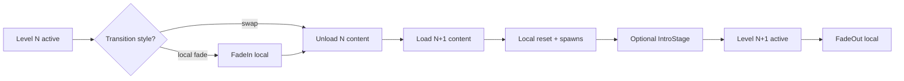

# Plano Geral — Trilho Macro (Routes) vs Trilho Local (Levels)

> Documento de entendimento/arquitetura (não é decisão final nem plano de implementação detalhado).
>
> Data: 2026-02-19 (America/Sao_Paulo)

## 1) Objetivo

Registrar **como o fluxo funciona hoje** e **qual é a intenção de separação** entre:

- **Routes (macro)**: “espaços macro” do jogo (Menu, Gameplay, Tutorial, Hub, Options, etc.).
- **Levels (local)**: conteúdo/variações **dentro** de uma rota macro (ex.: world 1, world 2, world 3; tuto1, tuto2; etc.).

A motivação central: **Routes e Levels são parecidos (ambos “carregam conteúdo”), mas com responsabilidades distintas**.

---

## 2) Vocabulário

### 2.1 Route (macro)
Route define:
- Conjunto de **cenas base** (load/unload/active).
- **Política macro** de reset (ex.: “Gameplay requer reset do mundo”).
- **Transição macro**: fade + loading HUD (canônico em SceneFlow).

Exemplos:
- `to-menu` (frontend)
- `to-gameplay` (entrada no macro Gameplay)
- `to-tutorial` (entrada no macro Tutorial)

### 2.2 Macro “context” (Macro Route Session)
Ao entrar numa rota macro, nasce um **contexto macro** (sessão) com:
- `routeId`/`routeRef`
- `transitionProfile`/`style`
- `requiresWorldReset` (policy)
- assinatura de transição (signature)

### 2.3 Level (local)
Level define:
- Um **conteúdo local** (contentId e/ou cenas aditivas locais).
- **Regras de reset local** (reiniciar o “ponto inicial” do level atual sem voltar ao level 1).
- **Camadas opcionais do Level**:
  - **IntroStage** (passa a ser responsabilidade do Level, não do macro).
  - “cortina” opcional (fade local), separada do fade macro.

### 2.4 Level Session
A cada Level ativo:
- existe **um** level “corrente” por macro (ex.: no macro Gameplay, somente um Level ativo por vez).
- níveis podem ter progressões/encadeamentos (A→B→C), inclusive “sublevels” (mundo 1-1, 1-2…).

---

## 3) Fluxo atual (alto nível) — como opera hoje

### 3.1 Boot → Menu
1. **Boot Scene** sobe e registra serviços globais (DI/infra).
2. **SceneFlow** dispara a transição inicial:
   - FadeIn → aplica **Route toMenu** → ScenesReady → FadeOut.
3. Estado final: **MenuScene** carregada/ativa (frontend).

### 3.2 Menu → Gameplay (macro)
1. Usuário aperta Play.
2. **Navigation** despacha intent `to-gameplay`.
3. **SceneFlow** inicia transição macro:
   - FadeIn → aplica **Route toGameplay** (load/unload/active) → ScenesReady.
4. **WorldLifecycle/Reset** (se policy exigir):
   - executa reset e spawns obrigatórios (Player, Eater, etc.).
5. **Conclusão do loading macro**:
   - completion gate,
   - FadeOut → gameplay “visível”.
6. **IntroStage** (atual): pode estar acoplado ao trilho de gameplay e gates de simulação.

---

## 4) Intenção proposta — “dois trilhos” (macro vs local)

A proposta consolida o comportamento em **dois trilhos coordenados**:

- **Trilho 1 (Macro Route)**: “muda de espaço macro” — SEMPRE com fade + HUD + loading.
- **Trilho 2 (Level Local)**: “muda conteúdo dentro do macro” — normalmente **sem** fechar a cortina (swap), mas pode ter “cortina local” se o Level pedir.

### 4.1 Regras-chave da intenção

1) **Toda entrada em Macro Route que tem Levels** deve:
- selecionar automaticamente o **primeiro Level** do catálogo da rota (ou um “default level”),
- executar pipeline do Level **antes** do FadeOut macro (ou seja, entra no cálculo de loading do macro).

2) **Transição entre Levels dentro do mesmo macro**:
- por padrão: **swap** (sem Fade macro),
- opcional: Level pode pedir **fade local** (in/out) e/ou IntroStage.

3) **Reset em 2 níveis**
- **Reset Macro** (WorldResetService / “reset de gameplay”):
  - reinicia o macro e retorna ao **Level 1** (ou default),
  - reexecuta reset/spawns obrigatórios do macro.
- **Reset Local** (Level reset):
  - reinicia **somente o level atual** (ex.: Level 3 volta ao começo do Level 3),
  - sem “voltar para o Level 1”.

4) **Levels não definem unload explícito**
- ao trocar de level, **o sistema local sempre descarrega** o conteúdo/cenas do level anterior (single-active-level invariant).

---

## 5) Diagrama — fluxo em dois trilhos

### 5.1 Macro Route Entry (com Levels)

```mermaid
flowchart TD
  A[Boot Scene] --> B[Global Composition / DI]
  B --> C[SceneFlow: TransitionStarted (macro)]
  C --> D[FadeIn (macro)]
  D --> E[Apply Macro Route: load/unload/active]
  E --> F[ScenesReady (macro)]
  F --> G{Macro Route has LevelCatalog?}

  G -- no --> H[WorldLifecycle policy + Reset/Spawns (if route requires)]
  H --> I[Completion Gate OK]
  I --> J[FadeOut (macro)]
  J --> K[Macro Visible (Menu/Gameplay/etc.)]

  G -- yes --> L[Select default/first Level]
  L --> M[Level Pipeline (local) BEFORE macro FadeOut]
  M --> H
```

### 5.2 Level Pipeline (executa dentro do loading macro)

```mermaid
flowchart TD
  L0[LevelSelected / LevelStartRequested] --> L1[Unload previous Level content (if any)]
  L1 --> L2[Resolve Level content (contentId / additive scenes)]
  L2 --> L3[Apply content: load additive scenes OR ContentSwap]
  L3 --> L4[Local Reset hooks (Level scope)]
  L4 --> L5[Spawn required actors (macro rules + level extras)]
  L5 --> L6{Level has IntroStage?}
  L6 -- yes --> L7[IntroStage (level-owned) + sim gates]
  L6 -- no --> L8[Mark LevelReady]
  L7 --> L8
```

### 5.3 Level-to-Level (dentro do mesmo macro)



---

## 6) Invariantes esperadas (quando isso estiver implementado)

### 6.1 Invariantes de Macro
- **Toda troca de Macro Route** usa:
  - FadeIn → (loading) → ScenesReady → completion gate → FadeOut.
- Se a rota requer reset:
  - existe evidência de **ResetWorldStarted/ResetCompleted** associada à transição.

### 6.2 Invariantes de Level
- Dentro de um macro com levels:
  - sempre há **exatamente 1 level ativo** por macro.
- Troca de Level:
  - descarrega conteúdo anterior (sempre),
  - aplica conteúdo novo,
  - executa reset local e spawns necessários,
  - IntroStage é **do Level** (não do macro), quando existir.

### 6.3 Observabilidade (logs âncora)
Exemplos (não normativos; só sinalizam o que queremos ver como contrato):
- `[QA][LevelFlow] NTo1 start levelId='...' routeRef='...'`
- `[OBS][SceneFlow] RouteResolvedVia=AssetRef ...`
- `[OBS][Level] LevelSelected ... contentId='...'`
- `[OBS][WorldLifecycle] ResetCompleted signature='...' reason='...'`
- `[OBS][ContentSwap] ContentSwapRequested ...`

---

## 7) Implicações arquiteturais (sem entrar em implementação ainda)

- **Route** continua sendo a fonte de verdade das cenas **macro** (load/unload/active).
- **Level** passa a ser a fonte de verdade do conteúdo **local** e de UX local (IntroStage, fade local opcional).
- O “swap” vira mecanismo do Level (direto ou reaproveitado do ContentSwap), e não do macro.
- “Decisão de reset” vira 2-tier (macro vs local), com ownership e contexto claros.

---

## 8) Próximos passos (documentais)

1. Criar um ADR de completude (Baseline 3.0) para registrar **DoD e evidências**.
2. Depois, propor **plano incremental** (fases) e abrir ADR por fase (implementação).
