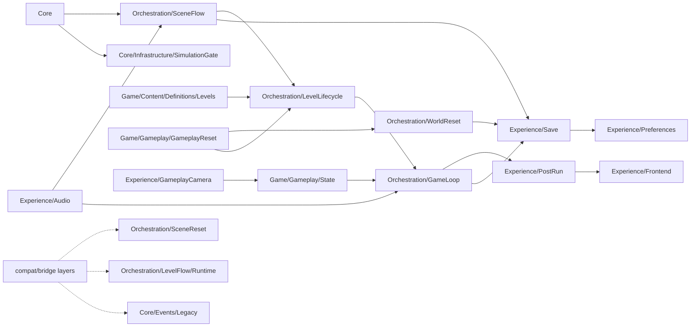

# Structural X-Ray: NewScripts

## Status

- Raio-x estrutural do estado atual de `Assets/_ImmersiveGames/NewScripts/**`.
- Fonte de verdade operacional: a arvore fisica atual.
- Fonte de apoio conceitual: `ADR-0001` e o snapshot estrutural congelado.
- Este documento descreve o estado consolidado, nao reabre arquitetura.

### Legenda rápida

- `estável`: área pronta para consulta normal.
- `compat`: área mantida por compatibilidade.
- `transição`: área viva, mas ainda em passagem para o owner novo.
- `bridge`: ponte explícita entre áreas.
- `placeholder`: superfície oficial, mas ainda não final.

## 1. Visao geral executiva

| Root | Papel | Dominio | Status |
|---|---|---|---|
| `Core` | Fundacao transversal: composicao, eventos, FSM, IDs, logging, validacao e infra base. | `Core Domain` | estavel |
| `Orchestration` | Backbone operacional: scene flow, reset, navigation, level lifecycle, game loop e bridges. | `Orchestration Domain` | estavel |
| `Game` | Ownership do jogo: content/definitions, gameplay state, GameplayReset, actors e spawn. | `Game Domain` | estavel |
| `Experience` | Borda de experiencia: post-run, audio, save placeholder, preferences, frontend e camera. | `Experience Domain` | estavel |
| `Docs` | Canon, guias, reports e snapshots. | suporte | estavel |

## 2. Arvore atual simplificada

```text
NewScripts/
  Core/
    Composition/
    Events/
      Legacy/                    (compat)
    Fsm/
    Identifiers/
    Infrastructure/
      SimulationGate/
      InputModes/
      SceneComposition/
    Logging/
    Validation/

  Orchestration/
    SceneFlow/
      Bootstrap/
      Fade/
      Interop/
      Loading/
      Navigation/
      Readiness/
      Runtime/
      Transition/
    WorldReset/
      Application/
      Bootstrap/
      Contracts/
      Domain/
      Guards/
      Policies/
      Runtime/
      Validation/
    ResetInterop/
      Bindings/
      Hooks/
      Runtime/
      Spawn/
    Navigation/
    LevelLifecycle/
      Bootstrap/
      Interop/
      Runtime/
    GameLoop/
      Bootstrap/
      Bridges/
      Commands/
      IntroStage/
      Pause/
      RunLifecycle/
      RunOutcome/
    SceneReset/
      Application/
      Bootstrap/
      Contracts/
      Domain/
      Guards/
      Policies/
      Runtime/
      Validation/
    LevelFlow/
      Runtime/                   (compat/transicao)

  Game/
    Content/
      Definitions/
        Levels/
          Config/
          Runtime/
    Gameplay/
      Actors/
      Bootstrap/
      Content/
      Spawn/
      State/
        Core/
        RuntimeSignals/
        Gate/
      GameplayReset/
        Coordination/
        Core/                    (residual/compat)
        Discovery/
        Execution/
        Integration/
        Policy/

  Experience/
    PostRun/
      Bootstrap/
      Handoff/
      Ownership/
      Presentation/
      Result/
    Audio/
      Bindings/
      Bootstrap/
      Bridges/
      Config/
      Content/
      Context/
      Editor/
      QA/
      Runtime/
        Core/
        Host/
        Models/
      Semantics/
    Save/
      Bootstrap/
      Contracts/
      Orchestration/
      Progression/
      Checkpoint/
      Models/
    Preferences/
    Frontend/
    Camera/

  Docs/
    ADRs/
    Archive/
    Canon/
    Guides/
    Modules/
    Plans/
    Reports/
```

## 3. Taxonomia e fluxo



> Nota: este fluxo é uma leitura macro da estrutura atual. Não é uma sequência técnica exaustiva de chamadas.

## 4. O que e cada area importante

### Core

| Pasta/Subarea | O que ela e | Para que serve | Observacao curta |
|---|---|---|---|
| `Core/Composition` | area de montagem | junta os servicos do runtime | base para o resto subir |
| `Core/Events` | barramento de eventos | liga areas sem acoplamento direto | `Legacy` e compat |
| `Core/Fsm` | base de estado | coordena transicoes internas | apoio para loops e gates |
| `Core/Identifiers` | nomes e identidades canonicas | evita ids soltos e repetidos | pouco visivel, mas central |
| `Core/Infrastructure/SimulationGate` | gate tecnico de simulacao | controla ready/pause/sim | fundacao operacional |
| `Core/Logging` | logs padronizados | ajuda leitura e diagnose | utilidade transversal |
| `Core/Validation` | validacao de contrato/config | falha rapido quando algo falta | protege boot e setup |

### Orchestration

| Pasta/Subarea | O que ela e | Para que serve | Observacao curta |
|---|---|---|---|
| `Orchestration/SceneFlow` | fluxo macro de cena | carrega, transita e prepara a cena | backbone de navegacao |
| `Orchestration/WorldReset` | reset global do mundo | reinicia o estado macro de forma deterministica | backbone de reset |
| `Orchestration/ResetInterop` | ponte de reset | conecta `SceneFlow` e `WorldReset` | bridge legitima |
| `Orchestration/Navigation` | navegacao macro | manda para menu, rota ou retorno | ponto de entrada de UI/flow |
| `Orchestration/LevelLifecycle` | lifecycle local do level | prepara, troca e encerra o level | owner operacional local |
| `Orchestration/GameLoop` | ciclo da run | controla run, outcome, pause, intro e comandos | runtime central da partida |
| `Orchestration/SceneReset` | reset local de cena | executa reset de cena com [compat] | ainda conversa com legado |
| `Orchestration/LevelFlow/Runtime` | [transição] compat de transicao | segura consumidores antigos | nome historico, nao alvo final |

### Game

| Pasta/Subarea | O que ela e | Para que serve | Observacao curta |
|---|---|---|---|
| `Game/Content/Definitions/Levels` | definicoes e conteudo de level | descreve o que o level e | owner do conteudo de level |
| `Game/Gameplay/Actors` | atores de gameplay | representa grupos e entidades do jogo | mais proximo do que o jogador ve |
| `Game/Gameplay/Spawn` | spawn de gameplay | cria e registra o que entra em cena | suporte de entrada do jogo |
| `Game/Gameplay/State` | estado jogavel | guarda estado e sinais do runtime | dividido em `Core`, `RuntimeSignals` e `Gate` |
| `Game/Gameplay/GameplayReset` | reset dos atores | decide, encontra e aplica o GameplayReset | dividido em `Coordination`, `Policy`, `Discovery`, `Execution` |
| `Game/Gameplay/Content` | conteudo ligado ao gameplay | material de gameplay e integracao | area de apoio, nao backbone |
| `Game/Gameplay/Bootstrap` | bootstrap local do gameplay | liga os servicos de gameplay | wiring, nao regra de jogo |

### Experience

| Pasta/Subarea | O que ela e | Para que serve | Observacao curta |
|---|---|---|---|
| `Experience/PostRun` | pos-run | organiza handoff, ownership, result e presentation | separada do loop principal |
| `Experience/Audio` | audio de experiencia | toca, adapta e conecta o audio ao contexto | runtime/context/semantics/bridges |
| `Experience/Save` | hooks e contratos de persistencia | expõe superfície estável para integrações futuras | `Progression` e `Checkpoint` ainda sao [placeholder] |
| `Experience/Preferences` | preferencias do jogador | guarda audio/video e outros ajustes | continua separada de `Save` |
| `Experience/Frontend` | UI/menu/quit flow | lida com menus e saida para interface | borda de experiencia |
| `Experience/GameplayCamera` | camera fora de gameplay | afasta camera do nucleo de gameplay | borda de apresentacao |

### Tabela por pasta

| Pasta/area | Papel | Dominio | Conecta com | Status |
|---|---|---|---|---|
| `Core/Composition` | wiring e composicao de runtime | Core | todos os roots | estavel |
| `Core/Events` | bus/eventos globais | Core | Orchestration, Game, Experience | estavel |
| `Core/Fsm` | maquinas de estado base | Core | GameLoop e transicoes | estavel |
| `Core/Infrastructure/SimulationGate` | gate tecnico de ready/pause/sim | Core | GameLoop, SceneFlow, Gameplay | estavel |
| `Core/Events/Legacy` | wrapper/[compat] historica | compat | codigo legado fora do canon novo | compat |
| `Orchestration/SceneFlow` | rota macro, loading, readiness, transition | Orchestration | LevelLifecycle, Save, Audio | estavel |
| `Orchestration/WorldReset` | reset deterministico global | Orchestration | GameplayReset, Save, SceneReset | estavel |
| `Orchestration/ResetInterop` | bridge entre scene flow e world reset | Orchestration | SceneFlow, WorldReset | bridge |
| `Orchestration/Navigation` | dispatch macro de menu/rota | Orchestration | Frontend, LevelLifecycle | estavel |
| `Orchestration/LevelLifecycle` | lifecycle local de level | Orchestration | SceneFlow, GameLoop, Levels | estavel |
| `Orchestration/GameLoop` | run state, outcome, pause, intro, commands e bridges | Orchestration | PostRun, Gameplay/State, Save | estavel |
| `Orchestration/SceneReset` | reset local de cena | Orchestration | WorldReset, SceneFlow | [compat]/bridge |
| `Orchestration/LevelFlow/Runtime` | [transição] compat de transicao | Orchestration | LevelLifecycle | transicao |
| `Game/Content/Definitions/Levels` | definitions/content de level | Game | LevelLifecycle, SceneFlow | estavel |
| `Game/Gameplay/Actors` | atores e ownership de actor groups | Game | GameplayReset, State, Spawn | estavel |
| `Game/Gameplay/Spawn` | criacao/registro de spawn de gameplay | Game | Actors, State | estavel |
| `Game/Gameplay/State` | estado jogavel e sinais de runtime | Game | GameLoop, SimulationGate | estavel |
| `Game/Gameplay/GameplayReset` | coordination/policy/discovery/execution do GameplayReset | Game | WorldReset, SceneReset | estavel |
| `Experience/PostRun` | handoff, ownership, result e presentation | Experience | GameLoop, Frontend, Save | estavel |
| `Experience/Audio` | runtime, contexto, semantica e bridges | Experience | SceneFlow, GameLoop, Preferences | estavel |
| `Experience/Save` | hooks oficiais e contratos [placeholder] | Experience | GameLoop, SceneFlow, WorldReset, Preferences | placeholder |
| `Experience/Preferences` | estado de preferencias | Experience | Save, Audio | estavel |
| `Experience/Frontend` | UI/menu/quit flow | Experience | Navigation, PostRun | estavel |
| `Experience/GameplayCamera` | fronteira de camera fora de gameplay | Experience | Gameplay/State | estavel |
| `Docs` | canon, guias, reports e snapshots | suporte | leitura humana | estavel |

## 5. Fluxo geral do projeto hoje

```text
Bootstrap
  -> Core/Composition + Core/Infrastructure/SimulationGate
  -> Orchestration/SceneFlow
    -> Orchestration/Navigation
    -> Orchestration/WorldReset
      -> Orchestration/SceneReset (compat/bridge)
    -> Orchestration/LevelLifecycle
      -> Game/Content/Definitions/Levels
      -> Game/Gameplay/State
      -> Game/Gameplay/GameplayReset
      -> Experience/GameplayCamera
      -> Orchestration/GameLoop
        -> Orchestration/GameLoop/IntroStage
        -> Orchestration/GameLoop/RunLifecycle
        -> Orchestration/GameLoop/RunOutcome
        -> Orchestration/GameLoop/Commands
        -> Orchestration/GameLoop/Pause
        -> Experience/PostRun
          -> Experience/Frontend
        -> Experience/Save
          -> Experience/Preferences
  -> Experience/Audio
```

### Onde entram as bordas

- `Navigation` entra antes e durante a rota macro.
- `Gameplay/State` alimenta o loop com estado jogavel.
- `Gameplay/GameplayReset` entra quando o mundo precisa ser resetado.
- `Audio` acompanha scene flow, gameplay e preferences.
- `Save` acompanha bootstrap, transicao, world reset e fim de run.
- `Preferences` fica como estado persistido de configuracao, separado do `Save`.

## 6. O que ainda e compatibilidade ou transicao

| Item | O que e hoje | Por que ainda existe | Observacao |
|---|---|---|---|
| `SceneResetFacade` | facade historica de reset local | ainda pode ter consumidor | compat util, nao alvo final |
| `FilteredEventBus.Legacy` | wrapper legado de eventos | ha uso fora do canon novo | compat externa legitima |
| `Orchestration/LevelFlow/Runtime` | compat de transicao | ainda segura consumidores antigos | nao e o owner novo |
| `Core/Events/Legacy` | area legada de eventos | conserva API antiga | deve sumir so no cleanup final |
| `Game/Gameplay/GameplayReset/Core` | residuo estrutural | ainda pode referenciar contratos | nao e subarea alvo |
| `Experience/Save` | placeholder funcional | superficie de hooks e contratos | progressao/checkpoint ainda nao sao finais |
| namespaces antigos | compat de seguranca | reduzem risco durante transicao | mantidos de proposito |

## 7. O que mudou em relacao ao modelo antigo

| Antes | Agora | Ganho principal |
|---|---|---|
| `Modules/*` era o centro | `Core`, `Orchestration`, `Game`, `Experience` viraram os roots | ownership ficou legivel |
| `LevelFlow` juntava lifecycle e conteudo | `LevelLifecycle` e `Game/Content/Definitions/Levels` ficaram separados | menos mistura de responsabilidades |
| `GameLoop` concentrava quase tudo da run | `RunLifecycle`, `RunOutcome`, `Commands`, `Bridges`, `Pause`, `IntroStage` | loop ficou mais claro |
| `PostRun` era um bloco unico | `Handoff`, `Ownership`, `Result`, `Presentation` | pos-run ficou explicito |
| `Gameplay` era bloco unico | `State` e `GameplayReset` foram quebrados por responsabilidade | fica mais facil achar onde mexer |
| `Audio` e `Save` pareciam sistema final | passaram a ser surface/placeholder com contratos | integra melhor sem prometer demais |
| `Gates` pareciam modulo proprio | entraram em `Core/Infrastructure/SimulationGate` | removeu um falso root |

## 8. Como usar este guia

- Se quer entender o backbone, leia `Core` e `Orchestration`.
- Se quer entender conteudo e jogo, leia `Game`.
- Se quer entender bordas e integracoes, leia `Experience`.
- Se quer entender compatibilidades ainda vivas, olhe `SceneResetFacade`, `FilteredEventBus.Legacy` e `Orchestration/LevelFlow/Runtime`.
- Se quer saber o que ainda e placeholder, olhe `Experience/Save`.

## 9. Não confundir com

- `LevelLifecycle` não é `Game/Content/Definitions/Levels`.
- `PostRun` não é `GameLoop`.
- `ResetInterop` não é owner de reset.
- `Experience/Save` não é um sistema final de progressão.
- `SceneResetFacade` não é destino final de arquitetura.
- `Orchestration/LevelFlow/Runtime` não é o owner novo; é [transição].

## 10. Se eu quero X, começo por Y

- Se quero entender boot e backbone, começo por `Core` e `Orchestration/SceneFlow`.
- Se quero entender o fluxo de partida, começo por `Orchestration/LevelLifecycle` e `Orchestration/GameLoop`.
- Se quero entender o jogo em si, começo por `Game/Content/Definitions/Levels` e `Game/Gameplay/*`.
- Se quero entender bordas e integrações, começo por `Experience/PostRun`, `Experience/Audio` e `Experience/Save`.
- Se quero entender compatibilidades ainda vivas, começo por `SceneResetFacade`, `FilteredEventBus.Legacy` e `Orchestration/LevelFlow/Runtime`.

