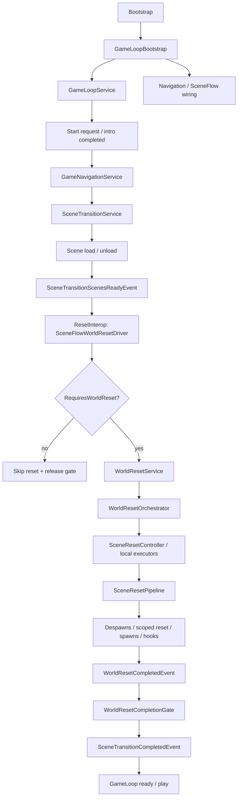

# Orchestration Backbone Graphs

## Macro flow

```mermaid
flowchart TD
  A[Bootstrap] --> B[GameLoopBootstrap]
  B --> C[GameLoopService]
  B --> D[Navigation / SceneFlow wiring]
  C --> E[Start request / intro completed]
  E --> F[GameNavigationService]
  F --> G[SceneTransitionService]

  G --> H[Scene load / unload]
  H --> I[SceneTransitionScenesReadyEvent]
  I --> J[ResetInterop: SceneFlowWorldResetDriver]

  J --> K{RequiresWorldReset?}
  K -- no --> L[Skip reset + release gate]
  K -- yes --> M[WorldResetService]

  M --> N[WorldResetOrchestrator]
  N --> O[SceneResetController / local executors]
  O --> P[SceneResetPipeline]
  P --> Q[Despawns / scoped reset / spawns / hooks]

  Q --> R[WorldResetCompletedEvent]
  R --> S[WorldResetCompletionGate]
  S --> T[SceneTransitionCompletedEvent]
  T --> U[GameLoop ready / play]
```

## Restart flow

```mermaid
flowchart LR
  A[Restart request] --> B[GameLoopCommands / PostLevelActions]
  B --> C[LevelFlowRuntimeService]
  C --> D[Navigation start gameplay]
  D --> E[SceneFlow transition]
  E --> F[ResetInterop]
  F --> G[WorldReset]
  G --> H[SceneReset local executor]
  H --> I[Spawn / rebind / hooks]
  I --> J[WorldResetCompletedEvent]
  J --> K[SceneTransitionCompletedEvent]
  K --> L[GameLoop ready]
```
