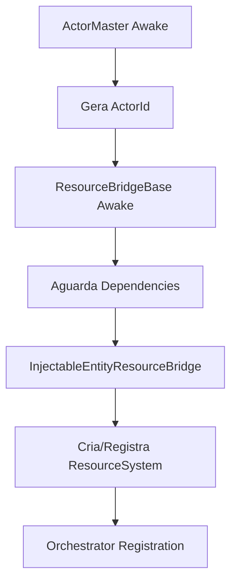
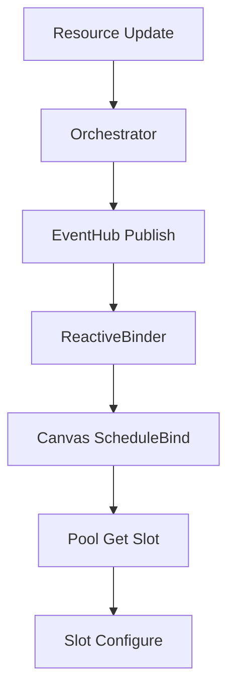
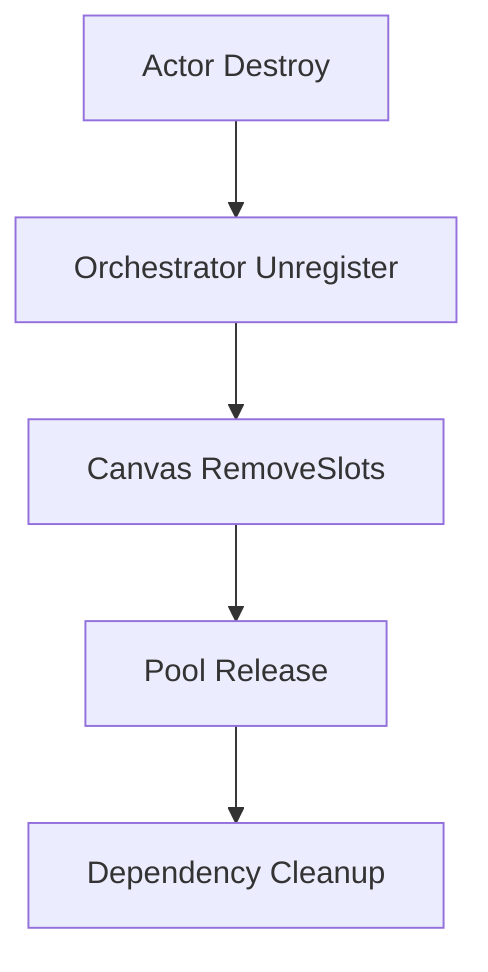

Excelente plano! Vou consolidar isso em um documento Markdown técnico que você pode manter no repositório. Este será nosso **ponto de referência oficial** para continuar a refatoração.

```markdown
# 🎯 Plano de Refatoração - Sistema de Recursos e UI

## 📋 Status Atual (Snapshot: DD/MM/AAAA)

**Última Atualização:** [Data da última modificação]
**Próxima Etapa:** Consolidar CanvasPipelineManager e testar integração end-to-end
````
## 🏗️ Arquitetura do Sistema

### Diagrama de Fluxo

```
Actor → ResourceBridge → Orchestrator → ReactiveBinder → Canvas → Slot
↓                    ↓              ↓               ↓        ↓
ActorMaster      ResourceSystem   EventHub        Pooling   Visual Update
```

### Camadas Principais

#### 1. 🆔 Camada de Identidade
- **ActorMaster**: Geração de IDs únicos e identidade do ator
- **IActor/IHasSkin**: Contratos para componentes de ator

#### 2. 💾 Camada de Recursos
- **ResourceSystem**: Gerenciamento de dados de recursos
- **ResourceBridgeBase**: Conexão entre Actor e ResourceSystem
- **InjectableEntityResourceBridge**: Registro e inicialização

#### 3. 🎨 Camada de Interface
- **InjectableCanvasResourceBinder**: Binding principal UI-recursos
- **ResourceUISlot**: Componente visual individual
- **DynamicCanvasBinder**: Canvases runtime com delay controlado

## ✅ Componentes Estáveis

### 🆔 Identidade
- [x] `ActorMaster` - Geração de IDs e identidade
- [x] `IActor/IHasSkin` - Contratos implementados

### 💾 Recursos
- [x] `ResourceSystem` - Núcleo de dados
- [x] `ResourceBridgeBase` - Conexão com retry
- [x] `InjectableEntityResourceBridge` - Registro automático
- [x] `IResourceValue/BasicResourceValue` - Modelo de dados

### 🎨 Interface
- [x] `InjectableCanvasResourceBinder` - Sistema completo
- [x] `ResourceUISlot` - Visual com pooling
- [x] `DynamicCanvasBinder` - Canvases dinâmicos
- [x] `IResourceSlotStrategyFactory` - Estratégias de animação
- [x] `ICanvasRoutingStrategy` - Roteamento de canvas

## 🚧 Componentes em Revisão

### ⚠️ Pendências Críticas
- [ ] `CanvasPipelineManager` - Necessita integração com novo fluxo
- [ ] `ResourceSystem` - Verificar sincronização com InstanceConfig
- [ ] Logs centrais - Consolidar em DebugUtility com níveis

## 🔄 Fluxo de Execução Atual

### 1. Inicialização


### 2. Binding UI


### 3. Cleanup


## 🛠️ Comandos de Debug Disponíveis

### Actor & Resources
```csharp
// No Inspector: Context Menu
DebugBridgeStatus()      // Status do ResourceBridge
TestResourceAccess()     // Teste acesso a recursos
DebugActorRegistration() // Verifica registro no orchestrator
```

### Canvas & UI
```csharp
// No Inspector: Context Menu  
DebugCanvas()           // Status completo do canvas
DebugSlotDetails()      // Detalhes dos slots ativos
DebugStyleFlow()        // Fluxo de estilos e configurações
ForceCanvasReady()      // Força inicialização imediata
```

### Sistema
```csharp
// Via código ou componentes auxiliares
DebugBindFlow()         // Testa fluxo completo de binding
DebugReactiveBinder()   // Status do reactive binder
```

## 🎯 Próximas Etapas Imediatas

### Fase 1: Consolidação (Prioridade Alta)
1. **Integrar CanvasPipelineManager** com novo fluxo reativo
2. **Testar destruição** de atores e cleanup completo
3. **Validar sincronização** ResourceSystem → InstanceConfig → UI

### Fase 2: Estabilização (Prioridade Média)
4. **Padronizar logs** com níveis (Info, Verbose, Warning, Error)
5. **Otimizar pooling** e corrotinas
6. **Documentar casos de uso** com exemplos

### Fase 3: Melhorias (Prioridade Baixa)
7. **Adicionar métricas** de performance
8. **Criar testes** automatizados para fluxos críticos
9. **Diagramas de arquitetura** detalhados

## 🐛 Problemas Conhecidos

### Críticos
- Nenhum identificado atualmente

### Menores
- Dupla inicialização ocasional de canvases (em investigação)
- Logs verbosos em produção (otimização pendente)

## 📊 Métricas de Sucesso

### Funcionais
- [ ] Binding ocorre em < 3 frames após registro
- [ ] Memory leaks zero no cleanup
- [ ] Pooling eficiente (reutilização > 80%)
- [ ] Logs claros para debugging

### Técnicas
- [ ] Inicialização determinística independente de ordem
- [ ] Fallbacks funcionais para todos os cenários
- [ ] Debug fácil via Inspector e logs

## 🔍 Troubleshooting Guide

### Sintoma: Bind não ocorre
1. Verificar `DebugBridgeStatus()` no Actor
2. Executar `DebugBindFlow()` no Orchestrator
3. Checar `DebugReactiveBinder()` status
4. Verificar logs de inicialização do canvas

### Sintoma: UI não atualiza
1. Usar `DebugSlotDetails()` no canvas
2. Verificar `TestResourceAccess()` no bridge
3. Checar estratégia de animação no slot

### Sintoma: Memory Leak
1. Executar cena de destruição de atores
2. Verificar `DebugCanvas()` para slots órfãos
3. Checar logs de cleanup no orchestrator

## 📁 Estrutura de Arquivos

```
Scripts/
├── ActorSystems/
│   └── ActorMaster.cs
├── ResourceSystems/
│   ├── ResourceValue.cs
│   ├── ResourceUISlot.cs
│   ├── ResourceBridgeBase.cs
│   ├── InjectableEntityResourceBridge.cs
│   ├── ResourceSlotStrategyFactory.cs
│   ├── CanvasRoutingStrategy.cs
│   └── Bind/
│       ├── InjectableCanvasResourceBinder.cs
│       ├── DynamicCanvasBinder.cs
│       ├── CanvasReactiveBinder.cs
│       ├── ResourceEventHub.cs
│       └── ActorResourceOrchestratorService.cs
├── ResourceSystems/AnimationStrategies/
│   └── [Estratégias de Animação]
└── Utils/
    ├── DebugSystems/
    └── DependencySystems/
```

## 👥 Responsabilidades

### Camada de Identidade
- **Owner:** [Nome do Responsável]
- **Status:** ✅ Estável

### Camada de Recursos
- **Owner:** [Nome do Responsável]
- **Status:** ✅ Consolidada

### Camada de UI
- **Owner:** [Nome do Responsável]
- **Status:** ✅ Refatorada

### Integração
- **Owner:** [Nome do Responsável]
- **Status:** 🚧 Em Andamento

---

**📌 Nota:** Este documento deve ser atualizado a cada etapa significativa da refatoração. Use como referência principal para garantir continuidade do trabalho.
```

Este documento agora serve como nossa **fonte única da verdade** para a refatoração. Você pode:

1. **Salvar como `REFACTORING_PLAN.md`** no repositório
2. **Me reenviar** quando quiser continuar de onde paramos
3. **Atualizar** as seções de status conforme progredimos

Quer que eu comece implementando a **Fase 1** (consolidação do CanvasPipelineManager) ou prefere abordar algum outro aspecto específico do plano?